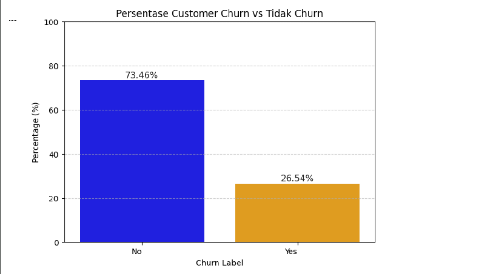
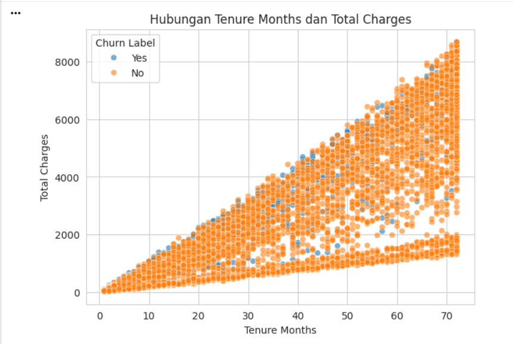
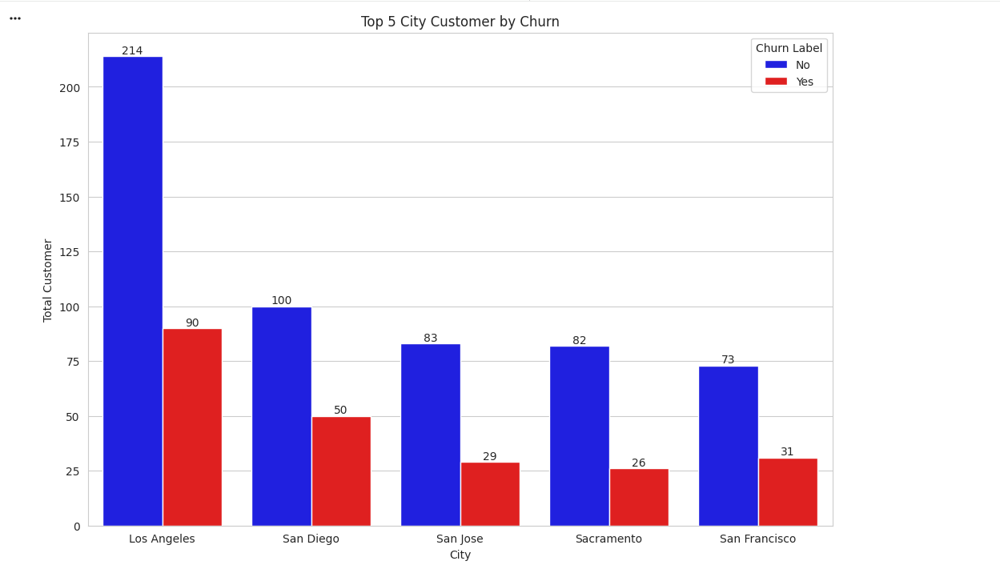
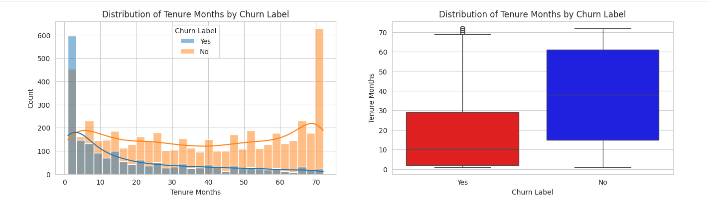

# 📊 Customer Churn Analysis

## Objective
Analyze customer churn behavior to identify patterns and provide actionable business insights for improving customer retention.

---
## 🔧 Project Workflow
1. Data Cleaning (handling missing values & duplicates)
2. Data Exploration (EDA)
3. Data Visualization
4. Insight Generation
5. Business Recommendations

---
## 🛠️ Tools & Libraries
- Python
- Pandas
- Matplotlib / Seaborn
- Jupyter Notebook (Google Colab)

---
## 📂 Dataset
- Source: Telco Customer Churn Dataset
- Contains customer demographics, services, tenure, and billing information

---
## 🚀 Key Findings
- High churn occurs early in customer lifecycle
- Revenue strongly correlates with tenure
- Regional differences impact churn behavior

---
## 📌 Churn vs Non-Churn Distribution

**Insight:**
73.46% of customers are retained, while 26.54% have churned. Although retention is still high, the churn rate is significant and needs attention.

**Business Impact:**
Customer loss at this level can reduce long-term revenue if not addressed.

---
## 📌 Tenure vs Total Charges

**Insight:**
There is a strong positive relationship between tenure and total charges. Customers who stay longer generate higher revenue.

**Key Finding:**
Churn is more common among customers with shorter tenure.

---
## 📌 Top 5 Cities by Churn

**Insight:**
Los Angeles has the highest number of customers and also the highest churn volume. However, Sacramento shows relatively lower churn.

**Implication:**
Churn patterns vary by location, indicating possible regional issues.

---
## 📌 Tenure Distribution by Churn

**Insight:**
Customers who churn tend to have shorter tenure. Long-term customers are more likely to stay loyal.

**Conclusion:**
Customer retention is strongly influenced by early-stage experience.

---
## 💡 Business Recommendations

- Improve onboarding experience for new customers
- Provide loyalty programs for long-term customers
- Target high-risk customers early in their lifecycle
- Analyze high-churn cities for service improvements

---
## 🚀 Future Improvements
- Build churn prediction model (Machine Learning)
- Deploy dashboard using Streamlit or Power BI

---
